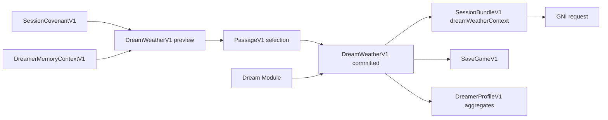

# Dream Weather Dread Budget Implementation Plan

> **For agentic workers:** REQUIRED SUB-SKILL: Use superpowers:subagent-driven-development (recommended) or superpowers:executing-plans to implement this plan task-by-task. Steps use checkbox (`- [ ]`) syntax for tracking.

**Goal:** Add a hidden Dream Weather layer and bounded Dread Budget that can shape Jungial sessions with unease, wonder, gravity, and tenderness while respecting the session covenant and keeping GNI-facing context clean, symbolic, and production-portable.

**Architecture:** Introduce `DreamWeatherV1`, `DreadBudgetV1`, and `WeatherTraceV1` as deterministic domain contracts. The runtime computes a weather preview before Passage selection, commits a final weather state after the dream module is selected, stores weather in save/profile aggregates, and sends only redacted symbolic weather context to GNI.

**Tech Stack:** Node.js ES modules, built-in `node:test`, JSON schema fixtures, existing `SeededRandom`, existing contract validator and simulation harness.

---

## Existing Context

The codebase already has:

- `src/sessionCovenant.js` for consent-shaped session tone and soft boundaries.
- `src/passageLattice.js` for deterministic Passage selection and EchoTrace creation.
- `src/simulation.js` for the playable loop.
- `src/dreamerProfile.js` for long-term memory aggregates.
- `src/ai.js` for GNI adapter request construction.
- `src/contracts.js` and `src/contractValidator.js` for runtime and fixture validation.
- `src/fixtureExporter.js` for contract fixture exports.
- `tests/namingGuardrail.test.js` for avoiding exposed clinical/internal naming.

Dream Weather should sit between covenant, Passage, dream module, and GNI:



The player-facing text must never call this a test, therapy system, assessment, exposure ladder, or profile. Internally use dream-native names only.

---

## Task 1: Add Dream Weather Domain Module

### Files

- Create `src/dreamWeather.js`
- Create `tests/dreamWeather.test.js`

### Test First

- [ ] Add `tests/dreamWeather.test.js` with these exact imports:

```js
import assert from "node:assert/strict";
import { describe, it } from "node:test";

import {
  DREAD_BUDGET_AXES,
  createDreamWeather,
  createWeatherTrace,
  normalizeDreadBudget,
  toGniWeatherContext,
} from "../src/dreamWeather.js";
import { createSessionCovenant } from "../src/sessionCovenant.js";
```

- [ ] Add this default weather test:

```js
describe("DreamWeatherV1", () => {
  it("creates a quiet bounded default weather state", () => {
    const weather = createDreamWeather({ seed: 11 });

    assert.equal(weather.schema, "DreamWeatherV1");
    assert.equal(weather.schemaVersion, 1);
    assert.equal(weather.weatherId, "weather-11");
    assert.equal(weather.mood, "stillness");
    assert.equal(weather.pressure, "low");
    assert.ok(weather.weatherTags.includes("silence"));
    assert.ok(weather.weatherTags.includes("threshold"));

    for (const axis of DREAD_BUDGET_AXES) {
      assert.ok(weather.dreadBudget[axis] >= 0);
      assert.ok(weather.dreadBudget[axis] <= 0.35);
    }
  });
});
```

- [ ] Add this covenant ceiling test:

```js
it("clamps dread budgets to the session covenant ceiling", () => {
  const covenant = createSessionCovenant({
    intensityBand: "gentle",
    sessionMode: "soft",
    allowedEdges: ["wonder", "shadow"],
  });

  const weather = createDreamWeather({
    seed: 23,
    covenant,
    vibeState: "tense",
    selectedDream: {
      id: "black-hole",
      symbolicTags: ["annihilation", "rebirth", "cosmic_mystery"],
    },
  });

  assert.equal(weather.ceiling, 0.35);
  assert.equal(weather.dreadBudget.cosmicDread <= 0.35, true);
  assert.equal(weather.dreadBudget.bodyUnease <= 0.35, true);
  assert.equal(weather.dreadBudget.pursuit <= 0.35, true);
});
```

- [ ] Add this hard boundary suppression test:

```js
it("suppresses weather tags and budget axes that cross hard boundaries", () => {
  const covenant = createSessionCovenant({
    intensityBand: "deep",
    hardBoundaries: ["pursuit"],
    allowedEdges: ["shadow", "wonder", "cosmic"],
  });

  const weather = createDreamWeather({
    seed: 41,
    covenant,
    vibeState: "tense",
    actionEvents: [{ type: "run", symbol: "pursuit" }],
    selectedDream: {
      id: "mirror-hall",
      symbolicTags: ["reflection", "shadow", "self_observation"],
    },
  });

  assert.equal(weather.dreadBudget.pursuit, 0);
  assert.ok(!weather.weatherTags.includes("pursuit"));
  assert.ok(weather.suppressedTags.includes("pursuit"));
});
```

- [ ] Add this deterministic test:

```js
it("is deterministic from matching inputs and seed", () => {
  const input = {
    seed: 89,
    archetypeVector: { Shadow: 0.6, Child: 0.2 },
    vibeState: "melancholic",
    recentEchoTraces: [{ echoId: "echo-a", motifs: ["mirror", "ash"], residueTags: ["shadow"] }],
  };

  assert.deepEqual(createDreamWeather(input), createDreamWeather(input));
});
```

- [ ] Add this GNI redaction test:

```js
it("exports redacted symbolic weather context for GNI", () => {
  const weather = createDreamWeather({
    seed: 144,
    selectedDream: { id: "garden", symbolicTags: ["growth", "fertility", "beauty"] },
    actionEvents: [{ type: "touch", symbol: "threshold_note", rawText: "private phrase" }],
  });
  const trace = createWeatherTrace({
    weather,
    sourceTags: ["garden", "threshold_note"],
    suppressedTags: [],
    seed: 144,
  });

  const context = toGniWeatherContext({ dreamWeather: weather, weatherTrace: trace });

  assert.equal(context.schema, "DreamWeatherContextV1");
  assert.deepEqual(Object.keys(context).sort(), [
    "dreadBudget",
    "pressure",
    "schema",
    "schemaVersion",
    "suppressedTags",
    "weatherTags",
  ]);
  assert.ok(!JSON.stringify(context).includes("private phrase"));
});
```

- [ ] Add this budget normalization test:

```js
it("normalizes all dread budget axes and preserves missing axes as zero", () => {
  const budget = normalizeDreadBudget({ pursuit: 2, cosmicDread: 0.5 }, 0.4);

  assert.equal(budget.pursuit, 0.4);
  assert.equal(budget.cosmicDread, 0.4);
  assert.equal(budget.bodyUnease, 0);
  assert.equal(Object.keys(budget).length, DREAD_BUDGET_AXES.length);
});
```

- [ ] Run:

```powershell
npm test -- tests/dreamWeather.test.js
```

- [ ] Confirm the test fails because `src/dreamWeather.js` does not exist.

### Implement

- [ ] Create `src/dreamWeather.js`:

```js
import { SeededRandom, stableHash } from "./random.js";

export const DREAD_BUDGET_AXES = Object.freeze([
  "pursuit",
  "bodyUnease",
  "cosmicDread",
  "disorientation",
  "loss",
  "watching",
  "claustrophobia",
]);

export const WEATHER_TAGS = Object.freeze([
  "silence",
  "threshold",
  "soft_lamp",
  "mirror",
  "ash",
  "mist",
  "static",
  "gravity",
  "garden",
  "warmth",
  "cold",
  "distant_voice",
  "watching",
  "boundless",
  "contained",
  "pursuit",
]);

const COVENANT_CEILINGS = Object.freeze({
  gentle: 0.35,
  curious: 0.5,
  deep: 0.68,
  dark: 0.82,
});

const MOOD_TAGS = Object.freeze({
  stillness: ["silence", "threshold", "soft_lamp"],
  hush: ["mist", "distant_voice", "contained"],
  gravity: ["gravity", "cold", "boundless"],
  flicker: ["static", "mirror", "watching"],
  bloom: ["garden", "warmth", "soft_lamp"],
  eclipse: ["ash", "gravity", "silence"],
});

const TAG_BUDGET_WEIGHTS = Object.freeze({
  annihilation: { cosmicDread: 0.28, loss: 0.14 },
  rebirth: { cosmicDread: 0.1, disorientation: 0.08 },
  cosmic_mystery: { cosmicDread: 0.24, disorientation: 0.12 },
  shadow: { watching: 0.18, disorientation: 0.08 },
  reflection: { watching: 0.1, disorientation: 0.08 },
  self_observation: { watching: 0.14 },
  containment: { claustrophobia: 0.16 },
  safety: { pursuit: -0.05, bodyUnease: -0.04 },
  memory: { loss: 0.12 },
  hearth: { claustrophobia: -0.04, loss: -0.02 },
  growth: { disorientation: -0.03 },
  innocence: { bodyUnease: -0.04 },
  fertility: { bodyUnease: 0.04 },
  beauty: { loss: -0.03 },
  dissolution: { cosmicDread: 0.18, disorientation: 0.2 },
  silence: { watching: -0.03 },
  pursuit: { pursuit: 0.32, bodyUnease: 0.08 },
});

const ARCHETYPE_WEATHER = Object.freeze({
  Shadow: { tags: ["ash", "watching"], budget: { watching: 0.12, disorientation: 0.06 } },
  Child: { tags: ["soft_lamp"], budget: { bodyUnease: -0.03 } },
  Seeker: { tags: ["threshold", "boundless"], budget: { disorientation: 0.06 } },
  Sage: { tags: ["silence"], budget: { cosmicDread: -0.03 } },
  Trickster: { tags: ["static", "mirror"], budget: { disorientation: 0.09 } },
  Mother: { tags: ["warmth", "contained"], budget: { loss: -0.04 } },
  Father: { tags: ["contained"], budget: { claustrophobia: 0.04 } },
  Creator: { tags: ["bloom"], budget: { disorientation: -0.02 } },
  Destroyer: { tags: ["gravity", "ash"], budget: { cosmicDread: 0.14, loss: 0.08 } },
});

function clamp(value, min = 0, max = 1) {
  return Math.min(max, Math.max(min, Number.isFinite(value) ? value : 0));
}

function round(value) {
  return Number(clamp(value).toFixed(3));
}

function unique(values) {
  return [...new Set(values.filter(Boolean))];
}

function covenantCeiling(covenant) {
  const band = covenant?.intensityBand ?? covenant?.intensity?.band ?? "gentle";
  return COVENANT_CEILINGS[band] ?? COVENANT_CEILINGS.gentle;
}

function hardBoundaries(covenant) {
  return new Set([...(covenant?.hardBoundaries ?? []), ...(covenant?.sessionLimits?.hardBoundaries ?? [])]);
}

function addBudget(target, patch, multiplier = 1) {
  for (const axis of DREAD_BUDGET_AXES) {
    target[axis] = (target[axis] ?? 0) + ((patch?.[axis] ?? 0) * multiplier);
  }
}

function weatherSeed(input) {
  if (Number.isInteger(input?.seed)) {
    return input.seed;
  }

  return stableHash({
    archetypeVector: input?.archetypeVector ?? {},
    vibeState: input?.vibeState ?? "quiet",
    selectedDream: input?.selectedDream?.id ?? null,
    activePassage: input?.activePassage?.id ?? null,
  });
}

function collectSourceTags(input) {
  return unique([
    ...(input?.selectedDream?.symbolicTags ?? []),
    ...(input?.activePassage?.motifs ?? []),
    ...(input?.activePassage?.pressureTags ?? []),
    ...(input?.dreamerMemoryContext?.strongSymbols ?? []),
    ...(input?.dreamerMemoryContext?.recentSymbols ?? []),
    ...(input?.recentEchoTraces ?? []).flatMap((trace) => [
      ...(trace?.motifs ?? []),
      ...(trace?.residueTags ?? []),
    ]),
    ...(input?.speechEvents ?? []).map((event) => event?.symbol),
    ...(input?.actionEvents ?? []).map((event) => event?.symbol),
  ]);
}

function moodFromInput({ budget, sourceTags, vibeState, random }) {
  const total = DREAD_BUDGET_AXES.reduce((sum, axis) => sum + budget[axis], 0);

  if (sourceTags.includes("growth") || sourceTags.includes("garden") || sourceTags.includes("beauty")) {
    return "bloom";
  }
  if (budget.cosmicDread > 0.3 || sourceTags.includes("cosmic_mystery")) {
    return random.pick(["gravity", "eclipse"]);
  }
  if (budget.watching > 0.25 || sourceTags.includes("mirror")) {
    return "flicker";
  }
  if (vibeState === "melancholic" || budget.loss > 0.2) {
    return "hush";
  }
  if (total > 0.55 || vibeState === "tense") {
    return random.pick(["hush", "flicker"]);
  }

  return "stillness";
}

function pressureFromBudget(budget) {
  const total = DREAD_BUDGET_AXES.reduce((sum, axis) => sum + budget[axis], 0);

  if (total >= 2.25) return "storm";
  if (total >= 1.3) return "heavy";
  if (total >= 0.55) return "medium";
  return "low";
}

export function normalizeDreadBudget(input = {}, ceiling = 0.35) {
  return DREAD_BUDGET_AXES.reduce((budget, axis) => {
    budget[axis] = round(clamp(input[axis] ?? 0, 0, ceiling));
    return budget;
  }, {});
}

export function createDreamWeather(input = {}) {
  const seed = weatherSeed(input);
  const random = new SeededRandom(seed);
  const ceiling = covenantCeiling(input.covenant);
  const boundaries = hardBoundaries(input.covenant);
  const sourceTags = collectSourceTags(input);
  const rawBudget = normalizeDreadBudget({}, 1);

  if (input.vibeState === "tense") {
    addBudget(rawBudget, { bodyUnease: 0.08, disorientation: 0.08, watching: 0.06 });
  }
  if (input.vibeState === "melancholic") {
    addBudget(rawBudget, { loss: 0.12, cosmicDread: 0.04 });
  }

  for (const tag of sourceTags) {
    addBudget(rawBudget, TAG_BUDGET_WEIGHTS[tag], 1);
  }

  for (const [archetype, weight] of Object.entries(input.archetypeVector ?? {})) {
    const weather = ARCHETYPE_WEATHER[archetype];
    if (weather && weight > 0.25) {
      addBudget(rawBudget, weather.budget, clamp(weight));
    }
  }

  const suppressedTags = [];
  for (const boundary of boundaries) {
    if (DREAD_BUDGET_AXES.includes(boundary)) {
      rawBudget[boundary] = 0;
      suppressedTags.push(boundary);
    }
  }

  const dreadBudget = normalizeDreadBudget(rawBudget, ceiling);
  const mood = moodFromInput({ budget: dreadBudget, sourceTags, vibeState: input.vibeState, random });
  const moodTags = MOOD_TAGS[mood] ?? MOOD_TAGS.stillness;
  const archetypeTags = Object.entries(input.archetypeVector ?? {})
    .filter(([, weight]) => weight > 0.25)
    .flatMap(([archetype]) => ARCHETYPE_WEATHER[archetype]?.tags ?? []);
  const weatherTags = unique([...moodTags, ...sourceTags, ...archetypeTags])
    .filter((tag) => !boundaries.has(tag))
    .filter((tag) => WEATHER_TAGS.includes(tag) || sourceTags.includes(tag))
    .slice(0, 9);

  for (const tag of sourceTags) {
    if (boundaries.has(tag) && !suppressedTags.includes(tag)) {
      suppressedTags.push(tag);
    }
  }

  return {
    schema: "DreamWeatherV1",
    schemaVersion: 1,
    weatherId: `weather-${seed}`,
    mood,
    pressure: pressureFromBudget(dreadBudget),
    ceiling,
    dreadBudget,
    weatherTags,
    suppressedTags: suppressedTags.sort(),
    atmosphere: {
      lightIntensity: round(0.45 + (1 - dreadBudget.cosmicDread) * 0.25 - dreadBudget.loss * 0.08),
      fogDensity: round(0.08 + dreadBudget.disorientation * 0.35 + dreadBudget.watching * 0.12),
      bloom: round(0.18 + (weatherTags.includes("soft_lamp") ? 0.2 : 0) + dreadBudget.cosmicDread * 0.1),
      exposure: round(0.55 - dreadBudget.cosmicDread * 0.15 - dreadBudget.loss * 0.08),
      warmth: round(0.45 + (weatherTags.includes("warmth") ? 0.25 : 0) - (weatherTags.includes("cold") ? 0.22 : 0)),
      movementDrag: round(0.02 + dreadBudget.claustrophobia * 0.08 + dreadBudget.bodyUnease * 0.04),
    },
  };
}

export function createWeatherTrace({ weather, sourceTags = [], suppressedTags = [], seed = 0 } = {}) {
  return {
    schema: "WeatherTraceV1",
    schemaVersion: 1,
    traceId: `weather-trace-${seed}`,
    weatherId: weather?.weatherId ?? null,
    mood: weather?.mood ?? "stillness",
    pressure: weather?.pressure ?? "low",
    sourceTags: unique(sourceTags).slice(0, 12),
    resultingTags: unique(weather?.weatherTags ?? []).slice(0, 12),
    suppressedTags: unique([...(weather?.suppressedTags ?? []), ...suppressedTags]).sort(),
    strongestDreadAxis: DREAD_BUDGET_AXES
      .map((axis) => [axis, weather?.dreadBudget?.[axis] ?? 0])
      .sort((left, right) => right[1] - left[1])[0][0],
  };
}

export function toGniWeatherContext({ dreamWeather, weatherTrace } = {}) {
  return {
    schema: "DreamWeatherContextV1",
    schemaVersion: 1,
    weatherTags: unique(dreamWeather?.weatherTags ?? weatherTrace?.resultingTags ?? []).slice(0, 8),
    pressure: dreamWeather?.pressure ?? "low",
    dreadBudget: normalizeDreadBudget(dreamWeather?.dreadBudget ?? {}, dreamWeather?.ceiling ?? 0.35),
    suppressedTags: unique([
      ...(dreamWeather?.suppressedTags ?? []),
      ...(weatherTrace?.suppressedTags ?? []),
    ]).sort(),
  };
}
```

- [ ] Run:

```powershell
npm test -- tests/dreamWeather.test.js
```

- [ ] Expected result:

```text
# pass 6
# fail 0
```

---

## Task 2: Add JSON Schemas and Runtime Validators

### Files

- Create `data/schemas/dread_budget.schema.json`
- Create `data/schemas/dream_weather.schema.json`
- Create `data/schemas/weather_trace.schema.json`
- Modify `data/schemas/session_bundle.schema.json`
- Modify `data/schemas/save_game.schema.json`
- Modify `src/contracts.js`
- Modify `src/contractValidator.js`
- Modify `tests/dataContracts.test.js`
- Modify `tests/contractValidator.test.js`

### Schemas

- [ ] Create `data/schemas/dread_budget.schema.json`:

```json
{
  "$schema": "https://json-schema.org/draft/2020-12/schema",
  "$id": "jungial://schemas/dread_budget.schema.json",
  "title": "DreadBudgetV1",
  "type": "object",
  "required": [
    "pursuit",
    "bodyUnease",
    "cosmicDread",
    "disorientation",
    "loss",
    "watching",
    "claustrophobia"
  ],
  "additionalProperties": false,
  "properties": {
    "pursuit": { "type": "number", "minimum": 0, "maximum": 1 },
    "bodyUnease": { "type": "number", "minimum": 0, "maximum": 1 },
    "cosmicDread": { "type": "number", "minimum": 0, "maximum": 1 },
    "disorientation": { "type": "number", "minimum": 0, "maximum": 1 },
    "loss": { "type": "number", "minimum": 0, "maximum": 1 },
    "watching": { "type": "number", "minimum": 0, "maximum": 1 },
    "claustrophobia": { "type": "number", "minimum": 0, "maximum": 1 }
  }
}
```

- [ ] Create `data/schemas/dream_weather.schema.json`:

```json
{
  "$schema": "https://json-schema.org/draft/2020-12/schema",
  "$id": "jungial://schemas/dream_weather.schema.json",
  "title": "DreamWeatherV1",
  "type": "object",
  "required": [
    "schema",
    "schemaVersion",
    "weatherId",
    "mood",
    "pressure",
    "ceiling",
    "dreadBudget",
    "weatherTags",
    "suppressedTags",
    "atmosphere"
  ],
  "additionalProperties": false,
  "properties": {
    "schema": { "const": "DreamWeatherV1" },
    "schemaVersion": { "const": 1 },
    "weatherId": { "type": "string", "minLength": 1 },
    "mood": {
      "type": "string",
      "enum": ["stillness", "hush", "gravity", "flicker", "bloom", "eclipse"]
    },
    "pressure": {
      "type": "string",
      "enum": ["low", "medium", "heavy", "storm"]
    },
    "ceiling": { "type": "number", "minimum": 0, "maximum": 1 },
    "dreadBudget": { "$ref": "dread_budget.schema.json" },
    "weatherTags": {
      "type": "array",
      "items": { "type": "string", "minLength": 1 },
      "uniqueItems": true
    },
    "suppressedTags": {
      "type": "array",
      "items": { "type": "string", "minLength": 1 },
      "uniqueItems": true
    },
    "atmosphere": {
      "type": "object",
      "required": ["lightIntensity", "fogDensity", "bloom", "exposure", "warmth", "movementDrag"],
      "additionalProperties": false,
      "properties": {
        "lightIntensity": { "type": "number", "minimum": 0, "maximum": 1 },
        "fogDensity": { "type": "number", "minimum": 0, "maximum": 1 },
        "bloom": { "type": "number", "minimum": 0, "maximum": 1 },
        "exposure": { "type": "number", "minimum": 0, "maximum": 1 },
        "warmth": { "type": "number", "minimum": 0, "maximum": 1 },
        "movementDrag": { "type": "number", "minimum": 0, "maximum": 1 }
      }
    }
  }
}
```

- [ ] Create `data/schemas/weather_trace.schema.json`:

```json
{
  "$schema": "https://json-schema.org/draft/2020-12/schema",
  "$id": "jungial://schemas/weather_trace.schema.json",
  "title": "WeatherTraceV1",
  "type": "object",
  "required": [
    "schema",
    "schemaVersion",
    "traceId",
    "weatherId",
    "mood",
    "pressure",
    "sourceTags",
    "resultingTags",
    "suppressedTags",
    "strongestDreadAxis"
  ],
  "additionalProperties": false,
  "properties": {
    "schema": { "const": "WeatherTraceV1" },
    "schemaVersion": { "const": 1 },
    "traceId": { "type": "string", "minLength": 1 },
    "weatherId": { "type": ["string", "null"] },
    "mood": { "type": "string" },
    "pressure": { "type": "string" },
    "sourceTags": {
      "type": "array",
      "items": { "type": "string", "minLength": 1 },
      "uniqueItems": true
    },
    "resultingTags": {
      "type": "array",
      "items": { "type": "string", "minLength": 1 },
      "uniqueItems": true
    },
    "suppressedTags": {
      "type": "array",
      "items": { "type": "string", "minLength": 1 },
      "uniqueItems": true
    },
    "strongestDreadAxis": {
      "type": "string",
      "enum": [
        "pursuit",
        "bodyUnease",
        "cosmicDread",
        "disorientation",
        "loss",
        "watching",
        "claustrophobia"
      ]
    }
  }
}
```

### Runtime Validators

- [ ] Modify `src/contracts.js` imports:

```js
import { DREAD_BUDGET_AXES } from "./dreamWeather.js";
```

- [ ] Add these validators near the other contract validators:

```js
export function validateDreadBudget(value, path = "dreadBudget") {
  assertPlainObject(value, path);
  for (const axis of DREAD_BUDGET_AXES) {
    assertNumber(value[axis], `${path}.${axis}`, { min: 0, max: 1 });
  }
  for (const key of Object.keys(value)) {
    if (!DREAD_BUDGET_AXES.includes(key)) {
      throw new ContractValidationError(`${path}.${key} is not a known dread axis`);
    }
  }
  return true;
}

export function validateDreamWeather(value, path = "dreamWeather") {
  assertPlainObject(value, path);
  assertString(value.schema, `${path}.schema`, { equals: "DreamWeatherV1" });
  assertNumber(value.schemaVersion, `${path}.schemaVersion`, { equals: 1 });
  assertString(value.weatherId, `${path}.weatherId`);
  assertString(value.mood, `${path}.mood`, {
    oneOf: ["stillness", "hush", "gravity", "flicker", "bloom", "eclipse"],
  });
  assertString(value.pressure, `${path}.pressure`, {
    oneOf: ["low", "medium", "heavy", "storm"],
  });
  assertNumber(value.ceiling, `${path}.ceiling`, { min: 0, max: 1 });
  validateDreadBudget(value.dreadBudget, `${path}.dreadBudget`);
  assertArray(value.weatherTags, `${path}.weatherTags`);
  assertArray(value.suppressedTags, `${path}.suppressedTags`);
  assertPlainObject(value.atmosphere, `${path}.atmosphere`);
  for (const key of ["lightIntensity", "fogDensity", "bloom", "exposure", "warmth", "movementDrag"]) {
    assertNumber(value.atmosphere[key], `${path}.atmosphere.${key}`, { min: 0, max: 1 });
  }
  return true;
}

export function validateWeatherTrace(value, path = "weatherTrace") {
  assertPlainObject(value, path);
  assertString(value.schema, `${path}.schema`, { equals: "WeatherTraceV1" });
  assertNumber(value.schemaVersion, `${path}.schemaVersion`, { equals: 1 });
  assertString(value.traceId, `${path}.traceId`);
  if (value.weatherId !== null) assertString(value.weatherId, `${path}.weatherId`);
  assertString(value.mood, `${path}.mood`);
  assertString(value.pressure, `${path}.pressure`);
  assertArray(value.sourceTags, `${path}.sourceTags`);
  assertArray(value.resultingTags, `${path}.resultingTags`);
  assertArray(value.suppressedTags, `${path}.suppressedTags`);
  assertString(value.strongestDreadAxis, `${path}.strongestDreadAxis`, {
    oneOf: DREAD_BUDGET_AXES,
  });
  return true;
}

export function validateDreamWeatherContext(value, path = "dreamWeatherContext") {
  assertPlainObject(value, path);
  assertString(value.schema, `${path}.schema`, { equals: "DreamWeatherContextV1" });
  assertNumber(value.schemaVersion, `${path}.schemaVersion`, { equals: 1 });
  assertArray(value.weatherTags, `${path}.weatherTags`);
  assertString(value.pressure, `${path}.pressure`);
  validateDreadBudget(value.dreadBudget, `${path}.dreadBudget`);
  assertArray(value.suppressedTags, `${path}.suppressedTags`);
  return true;
}
```

- [ ] In `validateSessionBundle`, add:

```js
  if (value.dreamWeatherContext !== undefined) {
    validateDreamWeatherContext(value.dreamWeatherContext, `${path}.dreamWeatherContext`);
  }
```

- [ ] In `validateSaveGame`, add optional saved weather checks:

```js
  if (value.dreamWeather !== undefined) {
    validateDreamWeather(value.dreamWeather, `${path}.dreamWeather`);
  }
  if (value.weatherTrace !== undefined) {
    validateWeatherTrace(value.weatherTrace, `${path}.weatherTrace`);
  }
```

- [ ] Modify `src/contractValidator.js` schema dispatch:

```js
import {
  validateDreadBudget,
  validateDreamWeather,
  validateWeatherTrace,
  // keep existing imports
} from "./contracts.js";
```

Add:

```js
  DreadBudgetV1: validateDreadBudget,
  DreamWeatherV1: validateDreamWeather,
  WeatherTraceV1: validateWeatherTrace,
```

### Tests

- [ ] In `tests/dataContracts.test.js`, import new validators:

```js
  validateDreadBudget,
  validateDreamWeather,
  validateWeatherTrace,
```

- [ ] Add tests using `createDreamWeather`, `createWeatherTrace`, and `normalizeDreadBudget`:

```js
it("validates DreamWeatherV1 contracts", () => {
  const weather = createDreamWeather({ seed: 34 });
  assert.equal(validateDreamWeather(weather), true);
});

it("validates WeatherTraceV1 contracts", () => {
  const weather = createDreamWeather({ seed: 55 });
  const trace = createWeatherTrace({ weather, sourceTags: ["threshold"], seed: 55 });
  assert.equal(validateWeatherTrace(trace), true);
});

it("validates DreadBudgetV1 contracts", () => {
  assert.equal(validateDreadBudget(normalizeDreadBudget({ pursuit: 0.1 }, 0.4)), true);
});
```

- [ ] In `tests/contractValidator.test.js`, add fixture validation cases after fixture export is wired in Task 6.

### Verify

- [ ] Run:

```powershell
npm test -- tests/dataContracts.test.js tests/contractValidator.test.js
```

- [ ] Expected result:

```text
# fail 0
```

---

## Task 3: Make Passage Selection Weather-Aware

### Files

- Modify `src/passageLattice.js`
- Modify `tests/passageLattice.test.js`

### Tests

- [ ] Add this test to `tests/passageLattice.test.js`:

```js
it("lets Dream Weather nudge compatible Passages without bypassing hard boundaries", () => {
  const covenant = createSessionCovenant({
    intensityBand: "deep",
    hardBoundaries: ["pursuit"],
    allowedEdges: ["shadow", "cosmic", "wonder"],
  });
  const dreamWeather = createDreamWeather({
    seed: 377,
    covenant,
    selectedDream: {
      id: "black-hole",
      symbolicTags: ["annihilation", "rebirth", "cosmic_mystery"],
    },
  });

  const passage = selectPassage({
    seed: 377,
    covenant,
    dreamWeather,
    dreamerMemoryContext: { strongSymbols: ["void", "star"], softenedSymbols: [], avoidedSymbols: ["pursuit"] },
    roomConfig: { roomState: "boundless" },
  });

  assert.equal(passage.schema, "PassageV1");
  assert.ok(!passage.motifs.includes("pursuit"));
  assert.ok(
    passage.pressureTags.includes("cosmic_mystery") ||
      passage.motifs.includes("void") ||
      passage.motifs.includes("star")
  );
});
```

- [ ] Add imports as needed:

```js
import { createDreamWeather } from "../src/dreamWeather.js";
```

### Implement

- [ ] In `src/passageLattice.js`, update `selectPassage` signature to accept `dreamWeather`:

```js
export function selectPassage({
  seed = 1,
  covenant,
  roomConfig = {},
  dreamerMemoryContext = {},
  architectState = {},
  dreamWeather = null,
} = {}) {
```

- [ ] Add helper near scoring helpers:

```js
function scoreWeatherAffinity(passage, dreamWeather) {
  if (!dreamWeather) return 0;

  const passageTags = new Set([
    ...(passage.motifs ?? []),
    ...(passage.pressureTags ?? []),
    ...(passage.formTags ?? []),
  ]);
  const weatherTags = new Set(dreamWeather.weatherTags ?? []);

  let score = 0;
  for (const tag of weatherTags) {
    if (passageTags.has(tag)) score += 0.12;
  }

  if ((dreamWeather.dreadBudget?.cosmicDread ?? 0) > 0.4) {
    if (passageTags.has("void")) score += 0.18;
    if (passageTags.has("star")) score += 0.18;
    if (passageTags.has("cosmic_mystery")) score += 0.2;
  }

  if ((dreamWeather.dreadBudget?.watching ?? 0) > 0.35) {
    if (passageTags.has("mirror")) score += 0.16;
    if (passageTags.has("shadow")) score += 0.12;
  }

  if ((dreamWeather.dreadBudget?.claustrophobia ?? 0) > 0.35 && passageTags.has("contained")) {
    score -= 0.16;
  }

  return score;
}
```

- [ ] In the passage scoring section, add:

```js
    score += scoreWeatherAffinity(passage, dreamWeather);
```

- [ ] Keep hard boundary filtering before score sorting so weather cannot revive a blocked Passage.

### Verify

- [ ] Run:

```powershell
npm test -- tests/passageLattice.test.js
```

- [ ] Expected result:

```text
# fail 0
```

---

## Task 4: Integrate Weather Into Simulation and GNI Context

### Files

- Modify `src/simulation.js`
- Modify `src/ai.js`
- Modify `tests/simulationHarness.test.js`
- Modify `tests/gniAdapter.test.js`
- Modify `tests/traceRecorder.test.js`

### Tests

- [ ] In `tests/simulationHarness.test.js`, add assertions to the main playable loop test:

```js
assert.equal(result.dreamWeather.schema, "DreamWeatherV1");
assert.equal(result.weatherTrace.schema, "WeatherTraceV1");
assert.equal(result.saveGame.dreamWeather.weatherId, result.dreamWeather.weatherId);
assert.equal(result.saveGame.weatherTrace.weatherId, result.dreamWeather.weatherId);
assert.equal(result.gniRequest.payload.dreamWeatherContext.schema, "DreamWeatherContextV1");
assert.ok(!JSON.stringify(result.gniRequest.payload.dreamWeatherContext).includes("rawText"));
```

- [ ] In `tests/gniAdapter.test.js`, add a payload passthrough test:

```js
it("passes redacted dream weather context to GNI", () => {
  const adapter = new GniAdapter({ endpoint: "local://gni" });
  const request = adapter.createProcessingRequest({
    sessionBundle: {
      schema: "SessionBundleV1",
      sessionId: "session-weather",
      recentSymbols: ["mirror"],
      recentActions: ["look"],
      dominantArchetype: "Shadow",
      vibeState: "tense",
      dreamWeatherContext: {
        schema: "DreamWeatherContextV1",
        schemaVersion: 1,
        weatherTags: ["mirror", "ash"],
        pressure: "medium",
        dreadBudget: {
          pursuit: 0,
          bodyUnease: 0.1,
          cosmicDread: 0.2,
          disorientation: 0.2,
          loss: 0,
          watching: 0.3,
          claustrophobia: 0,
        },
        suppressedTags: [],
      },
    },
  });

  assert.equal(request.payload.dreamWeatherContext.schema, "DreamWeatherContextV1");
});
```

- [ ] In `tests/traceRecorder.test.js`, update expected event order to include:

```text
dream.weather.created
```

after `passage.echo.created` and before `dream.module.selected` if the implementation commits weather before module selection, or after `dream.module.selected` if it commits after module selection. Use the final sequence from the code.

### Implement

- [ ] Modify `src/simulation.js` imports:

```js
import {
  createDreamWeather,
  createWeatherTrace,
  toGniWeatherContext,
} from "./dreamWeather.js";
```

- [ ] After `activeSessionCovenant` and before `selectPassage`, create preview weather:

```js
  const weatherPreview = createDreamWeather({
    seed: random.nextInt(1, 1_000_000),
    covenant: activeSessionCovenant,
    archetypeVector: witnessState.archetypeVector,
    vibeState: witnessState.vibeState,
    dreamerMemoryContext,
    speechEvents: witnessState.speechEvents,
    actionEvents: witnessState.actionEvents,
    recentEchoTraces: dreamerProfile.memory?.echoTraces ?? [],
  });
```

- [ ] Pass preview weather into Passage selection:

```js
  const activePassage = selectPassage({
    seed: random.nextInt(1, 1_000_000),
    covenant: activeSessionCovenant,
    roomConfig: thresholdChamber.roomConfig,
    dreamerMemoryContext,
    architectState,
    dreamWeather: weatherPreview,
  });
```

- [ ] After dream module selection, create committed weather:

```js
  const dreamWeather = createDreamWeather({
    seed: random.nextInt(1, 1_000_000),
    covenant: activeSessionCovenant,
    archetypeVector: witnessState.archetypeVector,
    vibeState: witnessState.vibeState,
    dreamerMemoryContext,
    selectedDream,
    activePassage,
    speechEvents: witnessState.speechEvents,
    actionEvents: witnessState.actionEvents,
    recentEchoTraces: [...(dreamerProfile.memory?.echoTraces ?? []), echoTrace],
  });
  const weatherTrace = createWeatherTrace({
    weather: dreamWeather,
    seed: random.nextInt(1, 1_000_000),
    sourceTags: [
      ...(selectedDream.symbolicTags ?? []),
      ...(activePassage.motifs ?? []),
      ...(activePassage.pressureTags ?? []),
    ],
  });
  traceRecorder.record("dream.weather.created", {
    weatherId: dreamWeather.weatherId,
    mood: dreamWeather.mood,
    pressure: dreamWeather.pressure,
    tags: dreamWeather.weatherTags,
  });
```

- [ ] Attach redacted context to the session bundle before GNI request creation:

```js
  sessionBundle.dreamWeatherContext = toGniWeatherContext({ dreamWeather, weatherTrace });
```

- [ ] Add weather to saved game:

```js
    dreamWeather,
    weatherTrace,
```

- [ ] Add weather to returned simulation object:

```js
    dreamWeather,
    weatherTrace,
```

- [ ] Modify `src/ai.js` in `createProcessingRequest` so the payload includes:

```js
      dreamWeatherContext: sessionBundle.dreamWeatherContext ?? null,
```

### Verify

- [ ] Run:

```powershell
npm test -- tests/simulationHarness.test.js tests/gniAdapter.test.js tests/traceRecorder.test.js
```

- [ ] Expected result:

```text
# fail 0
```

---

## Task 5: Add DreamerProfile Weather Memory Aggregates

### Files

- Modify `src/dreamerProfile.js`
- Modify `data/schemas/dreamer_profile.schema.json`
- Modify `data/schemas/dreamer_memory_context.schema.json`
- Modify `tests/dreamerProfile.test.js`
- Modify `tests/dataContracts.test.js`
- Modify `tests/simulationHarness.test.js`

### Tests

- [ ] In `tests/dreamerProfile.test.js`, add:

```js
it("remembers familiar dream weather without storing raw player input", () => {
  const profile = createDreamerProfile({ dreamerId: "dreamer-weather" });
  const weather = createDreamWeather({
    seed: 610,
    selectedDream: { id: "mirror-hall", symbolicTags: ["reflection", "shadow"] },
    actionEvents: [{ type: "speak", symbol: "mirror", rawText: "private words" }],
  });

  profile.recordSession({
    sessionId: "session-weather",
    symbols: ["mirror"],
    actions: ["look"],
    dreamWeather: weather,
  });

  const context = profile.toGniMemoryContext();
  assert.ok(context.familiarWeatherTags.length > 0);
  assert.ok(context.familiarDreadAxes.includes("watching") || context.familiarDreadAxes.includes("disorientation"));
  assert.ok(!JSON.stringify(context).includes("private words"));
});
```

- [ ] Add import:

```js
import { createDreamWeather } from "../src/dreamWeather.js";
```

### Implement

- [ ] In `createDreamerProfile`, extend initial memory:

```js
      weatherTags: {},
      dreadAxes: {},
```

- [ ] In `recordSession`, after symbols and Passage echo updates:

```js
    if (session.dreamWeather) {
      for (const tag of session.dreamWeather.weatherTags ?? []) {
        increment(this.memory.weatherTags, tag);
      }
      for (const [axis, value] of Object.entries(session.dreamWeather.dreadBudget ?? {})) {
        if (value > 0.05) {
          this.memory.dreadAxes[axis] = Number(((this.memory.dreadAxes[axis] ?? 0) + value).toFixed(3));
        }
      }
    }
```

- [ ] In `toGniMemoryContext`, add:

```js
      familiarWeatherTags: topKeys(this.memory.weatherTags, 8),
      familiarDreadAxes: topKeys(this.memory.dreadAxes, 5),
```

- [ ] Modify schema files:
  - Add `weatherTags` and `dreadAxes` object properties to `dreamer_profile.schema.json`.
  - Add `familiarWeatherTags` and `familiarDreadAxes` arrays to `dreamer_memory_context.schema.json`.

- [ ] Update test fixture literals in `tests/dataContracts.test.js` and `tests/simulationHarness.test.js` so all `DreamerProfileV1` examples include:

```js
weatherTags: {},
dreadAxes: {},
```

and all `DreamerMemoryContextV1` examples include:

```js
familiarWeatherTags: [],
familiarDreadAxes: [],
```

### Verify

- [ ] Run:

```powershell
npm test -- tests/dreamerProfile.test.js tests/dataContracts.test.js tests/simulationHarness.test.js
```

- [ ] Expected result:

```text
# fail 0
```

---

## Task 6: Export Fixtures and Update Contract Coverage

### Files

- Modify `src/fixtureExporter.js`
- Modify `package.json`
- Modify `tests/fixtureExporter.test.js`
- Modify `tests/contractValidator.test.js`
- Modify `README.md`
- Update generated fixtures under `data/contracts/examples/`

### Implement Fixtures

- [ ] In `src/fixtureExporter.js`, import:

```js
import {
  createDreamWeather,
  createWeatherTrace,
  normalizeDreadBudget,
} from "./dreamWeather.js";
```

- [ ] Add fixture entries:

```js
  "dread_budget_v1.json": normalizeDreadBudget({ pursuit: 0.1, cosmicDread: 0.2 }, 0.4),
  "dream_weather_v1.json": createDreamWeather({
    seed: 987,
    selectedDream: { id: "black-hole", symbolicTags: ["annihilation", "rebirth", "cosmic_mystery"] },
  }),
```

- [ ] Add a `weatherTrace` constant before returning the fixture map:

```js
const dreamWeatherFixture = createDreamWeather({
  seed: 987,
  selectedDream: { id: "black-hole", symbolicTags: ["annihilation", "rebirth", "cosmic_mystery"] },
});
const weatherTraceFixture = createWeatherTrace({
  weather: dreamWeatherFixture,
  sourceTags: ["annihilation", "rebirth", "cosmic_mystery"],
  seed: 987,
});
```

- [ ] Use constants in the map:

```js
  "dream_weather_v1.json": dreamWeatherFixture,
  "weather_trace_v1.json": weatherTraceFixture,
```

### Package Contract Script

- [ ] Add these fixtures to the `contracts` script in `package.json`:

```text
data/contracts/examples/dread_budget_v1.json
data/contracts/examples/dream_weather_v1.json
data/contracts/examples/weather_trace_v1.json
```

### Tests

- [ ] In `tests/fixtureExporter.test.js`, assert exported filenames include:

```js
assert.ok(files.includes("dread_budget_v1.json"));
assert.ok(files.includes("dream_weather_v1.json"));
assert.ok(files.includes("weather_trace_v1.json"));
```

- [ ] In `tests/contractValidator.test.js`, add:

```js
it("validates Dream Weather fixtures", () => {
  assert.equal(validateContractFixture(readFixture("dread_budget_v1.json")), true);
  assert.equal(validateContractFixture(readFixture("dream_weather_v1.json")), true);
  assert.equal(validateContractFixture(readFixture("weather_trace_v1.json")), true);
});
```

### Generate and Document

- [ ] Run:

```powershell
npm run export:fixtures
npm run contracts
```

- [ ] Update `README.md` contract/schema section with:

```md
- `DreamWeatherV1` records the hidden weather mood, symbolic weather tags, bounded dread budget, and atmosphere tuning values.
- `DreadBudgetV1` stores bounded axes used to shape unease without exposing player-facing mechanics.
- `WeatherTraceV1` records which symbolic inputs shaped a weather state and which tags were suppressed by the session covenant.
```

- [ ] Add fixture names to the README fixture list.

### Verify

- [ ] Run:

```powershell
npm test -- tests/fixtureExporter.test.js tests/contractValidator.test.js
npm run contracts
```

- [ ] Expected result:

```text
# fail 0
```

---

## Task 7: Update Scenario Baseline and Naming Guardrails

### Files

- Modify `tests/namingGuardrail.test.js`
- Update scenario baseline files only when the new weather trace event changes deterministic scenario output.

### Naming Tests

- [ ] In `tests/namingGuardrail.test.js`, add runtime file:

```js
"src/dreamWeather.js",
```

- [ ] Add forbidden internal-facing names:

```js
/fearScore/i,
/panicBudget/i,
/therapyWeather/i,
/diagnosisPressure/i,
/traumaWeather/i,
/psychologicalProfile/i,
/exposureLevel/i,
```

- [ ] Confirm current planned runtime names remain allowed:
  - `DreamWeatherV1`
  - `DreadBudgetV1`
  - `WeatherTraceV1`
  - `weatherTags`
  - `pressure`

### Scenario Baseline

- [ ] Run:

```powershell
npm run scenario:check
```

- [ ] When the only differences are the new `dream.weather.created` trace event and the presence of `dreamWeather` / `weatherTrace` in deterministic outputs, refresh the scenario baseline using the existing repo command:

```powershell
npm run scenario:update
```

- [ ] Re-run:

```powershell
npm run scenario:check
```

### Verify

- [ ] Run:

```powershell
npm test -- tests/namingGuardrail.test.js
```

- [ ] Expected result:

```text
# fail 0
```

---

## Task 8: Final Full Verification

- [ ] Run:

```powershell
npm run ready
```

- [ ] Expected result:

```text
validate:fixtures
contracts
scenario:check
# fail 0
```

- [ ] Run:

```powershell
git status --short
```

- [ ] Review all changed files.

- [ ] Commit with:

```powershell
git add src data tests docs README.md package.json
git commit -m "feat: add dream weather dread budget"
```

---

## Acceptance Criteria

- `DreamWeatherV1`, `DreadBudgetV1`, and `WeatherTraceV1` exist as deterministic contracts.
- Dread budgets clamp to the current session covenant intensity ceiling.
- Hard boundaries suppress matching weather tags and budget axes.
- Passage selection can be nudged by weather without bypassing covenant filtering.
- GNI receives `DreamWeatherContextV1`, not raw player speech or raw action text.
- SaveGame persists `dreamWeather` and `weatherTrace`.
- DreamerProfile remembers familiar weather tags and dread axes only as symbolic aggregates.
- Fixtures, schemas, contract validation, scenario baseline, and README are updated.
- Naming guardrails prevent clinical/internal names from entering runtime code.
- `npm run ready` passes.
